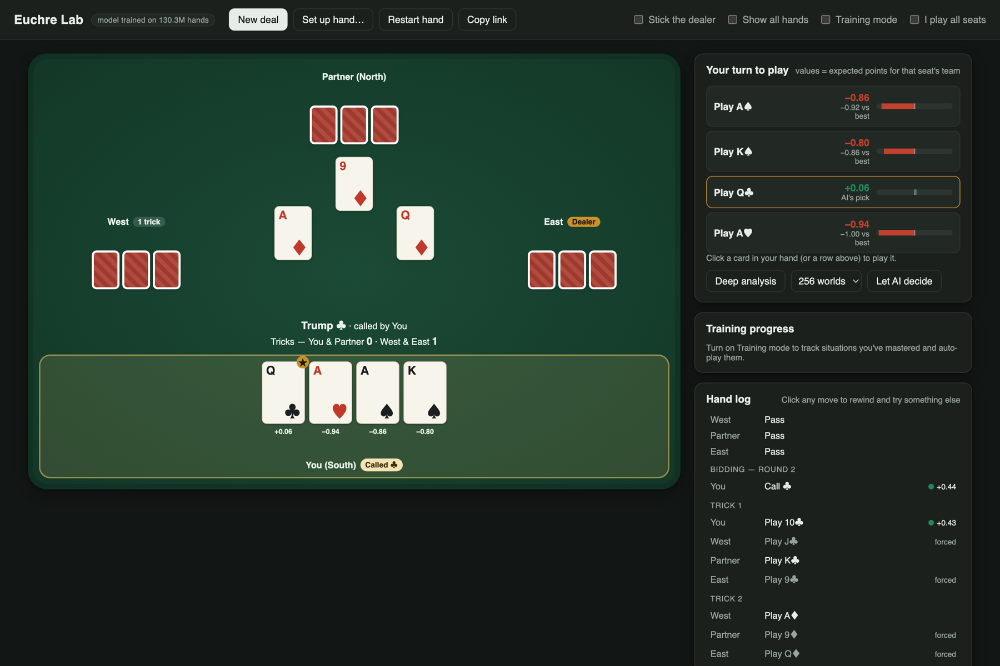

# Euchre Lab

A euchre AI trained purely by self-play, plus a web app that turns it into a coach. It shows how
much each option is worth, drills you on the decisions you get wrong, and stops quizzing you on
the ones you've mastered.

The model trains in 6 hours on a laptop (130M self-play hands on an Apple M3 Pro) and wins
**76% of games** against a solid rule-based player. The repo also records the experiments done to
find out how far it is from optimal play. The short version: another trained bot can barely
exploit it, and even a bot that can **see every card** only beats it 84.5% of the time.



## Quick start

A trained model ships with the repo, so no training is needed to use the app.

```bash
git clone https://github.com/Meskupie/euchre-lab.git && cd euchre-lab
python3 -m venv .venv && .venv/bin/pip install -r requirements.txt
.venv/bin/uvicorn server.app:app --port 8000     # then open http://localhost:8000
```

Python 3.10+ is required. Inference runs comfortably on a CPU.

## The app

**Training mode** (the default) is a drill that only stops for decisions that matter:

* **Automatic moves.** Forced moves play themselves, and so do decisions where every option is
  worth the same (within 0.03 points).
* **Situations.** Every real decision is filed under a human-readable situation, e.g.
  *"Following · last to play · off-suit led · opponent winning · void in the led suit · can win →
  Trump in low"*. While you're choosing you see the description, not the answer.
* **Mastery.** Get a situation right 3 times in a row (adjustable) and it's mastered: from then on
  it plays itself, except for a review 10% of the time. A miss resets the streak. Over time the
  game stops mostly at the rare, genuinely hard spots. Among ~950 distinct situations, the 50 most
  common cover half of all decisions.
* **Feedback on mistakes.** A mistake pauses the game and shows the AI's choice, how many points
  yours cost, and the lesson. You can retry the decision (retries aren't scored) or continue.
* **Progress.** A panel lists your costliest situations and the ones you've mastered. Progress is
  saved to `data/progress.json`.

**Explore mode** (training mode off) shows the AI's value for every option up front:

* **Values.** Each option shows expected points for the acting team; ★ marks the AI's choice.
* **Hand log.** Every move is rated, and you can click any move to rewind and try something else.
* **Set up hand…** places specific cards in any hand, the upcard, or the kitty, and sets the dealer.
* **Deep analysis** re-deals the hidden cards hundreds of ways consistent with the bidding and
  play so far, plays every option out, and shows where the unseen cards probably are.
* **I play all seats** lets you choose for everyone.
* **Show all hands** reveals the other seats and the AI's reasoning for them.
* **Copy link** shares the exact position. `?train=0&reveal=1` in the URL sets the toggles.

## Rules

Standard North American euchre: a 24-card deck (9–A), partners sit across, and the deal rotates
left.

* **Bidding.** In round 1, players may order up the upcard; the dealer picks it up and discards.
  In round 2, players may name any other suit.
* **Going alone.** Anyone may go alone; their partner sits out. If the dealer's partner orders up
  alone, the dealer sits out and doesn't pick up.
* **All pass.** If everyone passes twice, the hand is thrown in, unless *stick the dealer* is on
  (toggle in the app).
* **Scoring.** Makers taking 3–4 tricks score 1, a march (all 5) scores 2, and a lone march
  scores 4. Holding the makers under 3 (a euchre) scores 2 for the defenders. Games are to 10.

## How the AI works

**Self-play with Deep Monte-Carlo Q-learning**, the method behind
[DouZero](https://arxiv.org/abs/2106.06135):

* **Actors.** Five actor processes each play 256 simultaneous hands with an ε-greedy copy of the
  network. Every non-forced decision becomes a sample: (observation, action, final point
  differential for the acting team).
* **Learner.** A learner on the GPU regresses Q(observation)[action] onto those returns. The
  output is directly **"expected points for my team if I do this and everyone plays well
  afterwards"**, which is exactly what the app displays.

**What it sees** (859 binary features):

* its own hand and the upcard;
* the full bidding, including who made trump and who is alone;
* every card each seat has played, in order;
* known voids, unseen cards, tricks won, and (for the dealer) its own discard.

Everything is relative to the observer's seat and expressed in a trump-relative suit frame
(right bower, left bower, A, K, … of trump; then next suit; then the two off-colour suits). That
way what it learns about one trump suit applies to all four.

**The network** is a residual MLP (4 blocks × 512 wide, 2.6M parameters) with one output per
action.

**Deep analysis** (`euchre/search.py`) does belief-weighted Monte-Carlo sampling:

1. Re-deal the hidden cards many ways consistent with what the player has seen.
2. Weight each deal by how likely the other players' actual bids and plays are under the
   network's policy. This is how it reads the table: if partner ordered up, deals where partner
   holds trump count more.
3. Play every option out in every deal and average the results.

This is the policy-based inference used by strong
[Skat programs](https://arxiv.org/abs/1905.10911).

**Playing to win the game** (`ScoreAwareAgent`). Hands are scored in points, but games are won at
10, so a point is worth more or less depending on the score:

* **An outcome head** predicts, for each action, the probability of every hand result (−4, −2,
  −1, 0, +1, +2, +4).
* **A win-probability table** gives the chance of winning from every score. It's computed by value
  iteration over those outcome frequencies (`euchre/winprob.py`).
* **The decision rule** uses the well-trained points value for the average and the outcome
  distribution only for the non-linear part of the win table. At 0–0 it plays exactly like the
  points model; near the end of a game it knows that, say, a euchre would lose outright.

## How good is it?

All comparisons are **duplicate**: each deal (or each full game's sequence of deals) is played
twice with the teams swapped, which cancels most of the luck of the cards. ± is one standard
error.

| Matchup | Points per deal | Games to 10 won |
|---|---|---|
| Model vs rule-based bot | **+0.307 ± 0.006** | **75.8% / 75.5%** (no stick / stick) |
| Model vs its own 15-minute checkpoint | +0.111 ± 0.005 | 60% |
| Best response *trained to beat the model* (2 h, 33M hands) vs model | **+0.005 ± 0.003** | ≈ 50% |
| Score-aware play vs model | 0 (same hand play) | **50.57% ± 0.12%** (40,000 games) |
| End-to-end game head vs model | — | 48.2% ± 0.15% (40,000 games) |
| Belief search vs model | −0.001 ± 0.009 | — |
| **Oracle that sees every card** vs model | — | **84.5% ± 0.7%** |

### Is euchre solved? Can we prove the bot is optimal?

No, and no. Nobody has solved euchre, and the game is far too large to solve exactly: there are
about 10¹⁴ possible deals before counting bidding and play. Worse, it's a *team* game with hidden
information where partners can't share what they know. Computing optimal strategies for games
like that (euchre, bridge) is
[NP-hard](http://proceedings.mlr.press/v119/zhang20c/zhang20c.pdf) in general.

What can be measured is **exploitability**: how much a best response, trained specifically to beat
the bot, can win from it. Zero exploitability means no strategy beats the bot in expectation. It's
the standard yardstick for imperfect-information game AI, and it's what the table above
approximates:

* **The best response** was warm-started from the model and trained for 2 hours solely to beat it.
  It found **+0.005 points per deal**, about 1/60th of the model's edge over the rule-based bot.
  An RL best response is only a lower bound on true exploitability, but by this standard the
  model is close to unexploitable at the level of individual hands.
* **Luck puts a hard ceiling on any bot.** The oracle, trained with the other hands and the kitty
  visible, still loses 1 game in 6 to the model. No legitimate bot can beat the model anywhere
  near 100 times out of 100.

### What moved the needle, and what didn't

* ✅ **Score-aware play** (+0.57 percentage points of game wins): a small but statistically solid
  gain. Most decisions happen when the score barely matters.
* ❌ **Showing the network the score** and learning win probability end-to-end in the shared
  network degraded hand play: 45–49% against the model after an hour.
* ❌ **A separate game head trained on actual game outcomes** on top of frozen features: the ±1
  game results are too noisy compared with the tiny value differences at most scores (48.2%).
* ❌ **Belief search at decision time**: no measurable gain, a sign the network is already near its
  own one-step policy improvement. It's still the most useful tool for *explaining* a decision.
* 🔍 **Exploration leakage** (design audit). ε-greedy Monte-Carlo targets include the random moves
  made later in the hand, so values describe a world where everyone blunders 3% of the time. The
  fix, used for the later heads, is to drop samples whose return includes a later exploratory
  move (`--greedy-targets`, Watkins-style).
* 🔍 **Style.** The model goes alone on 23% of hands (mostly the dealer after three passes,
  averaging +1.9 points and euchred only 4% of the time) and never lets a hand be thrown in. The
  best-response result suggests these are strengths, not exploitable quirks.

Related work: [DouZero](https://arxiv.org/abs/2106.06135) (Deep Monte-Carlo),
[Suphx](https://arxiv.org/abs/2003.13590) (oracle guiding, whole-game rewards),
[Rudolph et al. 2025](https://arxiv.org/abs/2502.08938) (policy gradient in imperfect-information
games), [Policy Based Inference in Trick-Taking Games](https://arxiv.org/abs/1905.10911).

## Reproducing

```bash
.venv/bin/pip install -r requirements-dev.txt
.venv/bin/python train.py --run runs/main --hours 6            # the base model (~6 h on an M3 Pro)
.venv/bin/python train.py --help                               # all variants and recipes
.venv/bin/python evaluate.py models/euchre.pt heuristic        # model vs rule-based bot
.venv/bin/python evaluate.py score-aware:models/euchre.pt models/euchre.pt --deals 0 --games 40000
.venv/bin/python -m euchre.winprob models/euchre.pt            # rebuild the win-probability tables
```

The top of `train.py` lists the exact command for each experiment above: best response, outcome
head, game head, and oracle. Training uses Apple MPS or CUDA when available and falls back to the
CPU. A run writes checkpoints and `eval.jsonl` to its `--run` directory. To watch a model improve
live, point the app at it with `EUCHRE_MODEL=runs/main/latest.pt`.

## Project layout

```
euchre/engine.py      rules engine (one hand = one Game; replayable action history)
euchre/cards.py       card encoding, bower-aware trick power tables, canonical suit frames
euchre/encode.py      observation features + 33-way canonical action space
euchre/model.py       the network (points, outcome, and game heads)
euchre/agents.py      network / score-aware agents, batched play, duplicate matches
euchre/search.py      belief-weighted Monte-Carlo analysis
euchre/winprob.py     game win-probability tables
euchre/situations.py  human-readable situation categories for training mode
euchre/heuristic.py   rule-based benchmark bot
train.py              self-play training
evaluate.py           head-to-head benchmarks
server/               FastAPI backend (stateless: replays deal + moves on every request)
web/                  the app (vanilla JS, no build step)
models/               trained model + win tables
```

## Development

```bash
.venv/bin/pip install -r requirements-dev.txt
.venv/bin/ruff check . && .venv/bin/pytest -q
```

## License

MIT
